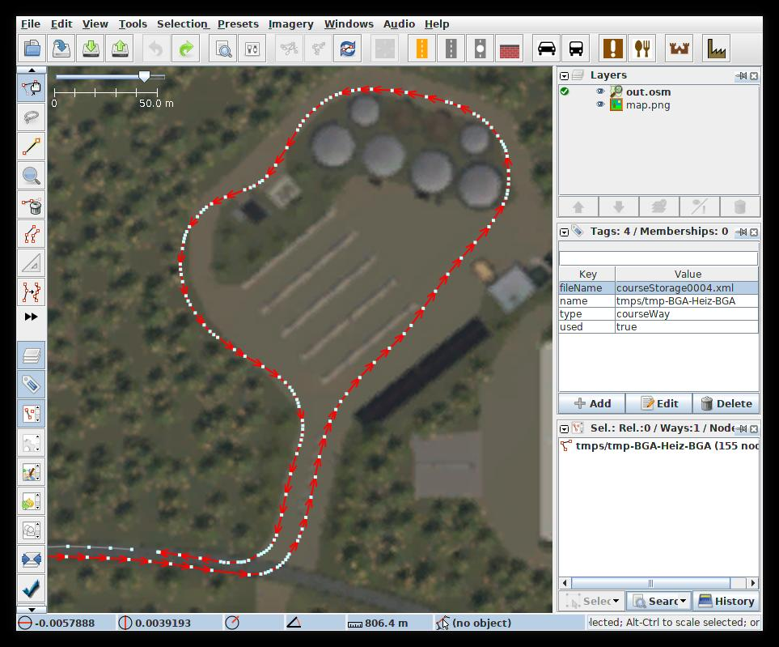

Courseplay to OpenStreetMap
===========================
Um die gespeicherten gespeicherten Kurse aus Courseplay einfach bearbeiten zu können, konvertiert dieses Programm die
von Courseplay generierten XML Dateien in das Openstreetmap-Format, welches dann mit
[JOSM](https://josm.openstreetmap.de/) editiert werden kann:

Verwendung
----------
1. JAR-Datei herunterladen und speichern und ausführen.
2. `Course -> OSM` wählen und aus dem Courseplay-Ordner die `courseManager.xml` auswählen
3. Die Kartengröße in Meter Kantenlänge angeben (normalerweise 2048 oder 4096). Der Wert wird später verwendet um
dabei zu helfen ein Hintergrundbild auszurichten.
4. Eine Datei wählen, in die geschrieben werden soll. Erzeugt wird eine einzelne OSM-Datei, die alle gespeicherten Kurse
enthält.
5. Den [Java OpenStreetMap Editor](https://josm.openstreetmap.de/) herunterladen.
6. Die in Schritt 4 generierte Datei öffnen. Zu sehen ist zum Beispiel:
    
    
7. Optional: Eine Hintergrundbild hinterlegen
    1. Unter Bearbeiten -> Einstellungen -> Plugins das Plugin "PicLayer" installieren
    2. Eine Zoomstufe einstellen, so dass die komplette Karte zu sehen ist (Zoomen mit Scrollrad, verschieben mit
    gedrückter rechter Maustaste). Dabei hilft das äußere Quadrat, welches die Kartengröße anzeigt   
    3. Im Menü über Hintergrundbilder -> Neue Bildebene aus Datei ein Bild von der Map laden
    4. Bei "Ebenen" oben rechts die Bildebene setzen (den weißen Haken im grünen Kreis auf die Bildebene setzen)
    5. Mit den Werkzeugen in der Leiste links die Karte passend verschieben. Dabei hilft wieder das äußere Quadrat.
    Siehe dazu auch [die Anleitung von PicLayer](https://wiki.openstreetmap.org/wiki/JOSM/Plugins/PicLayer).
8. Die Kurse nach belieben bearbeiten und speichern.
9. Im Konverter `OSM -> Course` wählen
10. Die gespeicherte OSM-Datei angeben
11. Ein Verzeichnis angeben, in dem die neuen Courseplay-Dateien gespeichert werden sollen. Achtung: Bestehende Dateien
    werden ohne Nachfrage überschrieben. Verwende ein leeres Verzeichnis oder erstelle vorher ein Backup.       

Spenden
-------
Dieses Programm ist kostenlos. Wenn es dir gefällt und du dich bedanken möchtest, kannst du mir jedoch eine Spende
zukommen lassen:

